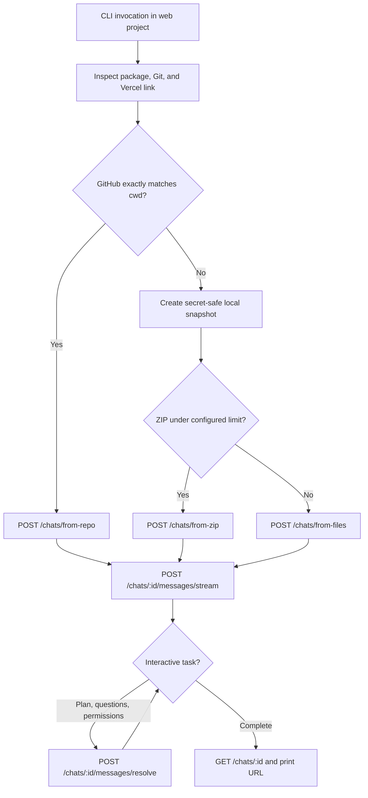

# Architecture

`v0-reimagine` is a small TypeScript ESM CLI whose source is bundled into one Node.js
entrypoint with esbuild; runtime packages remain native imports installed by the package
manager. The command surface mirrors Vercel CLI conventions while the v0 integration uses
direct v2 HTTP requests, so the tool is not coupled to a beta SDK release.

## Module boundaries

- `src/cli` owns parsing and the Vercel-style command surface.
- `src/commands` translates commands into project inspection and v0 operations.
- `src/auth` owns key precedence, validation, and private on-disk storage.
- `src/project` owns Git safety, Vercel context, framework detection, and snapshots.
- `src/v0` owns v2 schemas, HTTP/SSE behavior, prompts, and interactive task resolution.
- `src/ui` keeps human progress on stderr and result data on stdout.

## Safety invariants

1. A GitHub import is used only when its upstream is a faithful copy of the local project.
2. Known credential files are never included in a local snapshot.
3. A likely embedded secret stops a real run before authentication or upload.
4. Public chat creation requires either terminal confirmation or `--yes`.
5. v0 permission requests default to denied and are never auto-approved by `--yes`.
6. The CLI does not call v0's Vercel project-creation endpoint.
7. Saved API keys are written atomically with owner-only permissions.

## API compatibility

Runtime responses are checked with Zod at the boundary. Retriable network failures, HTTP
429 responses, and server errors use bounded exponential backoff. Authentication and
authorization failures receive actionable CLI hints. SSE parsing ignores unknown events
so new progress event types remain forward-compatible, while final messages are still
schema-validated before interaction resolution.
